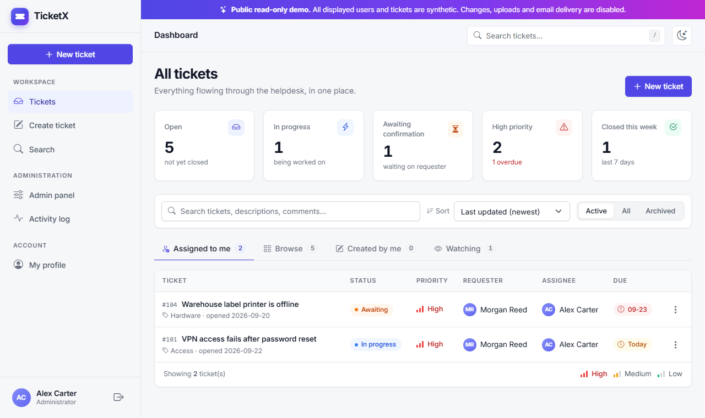
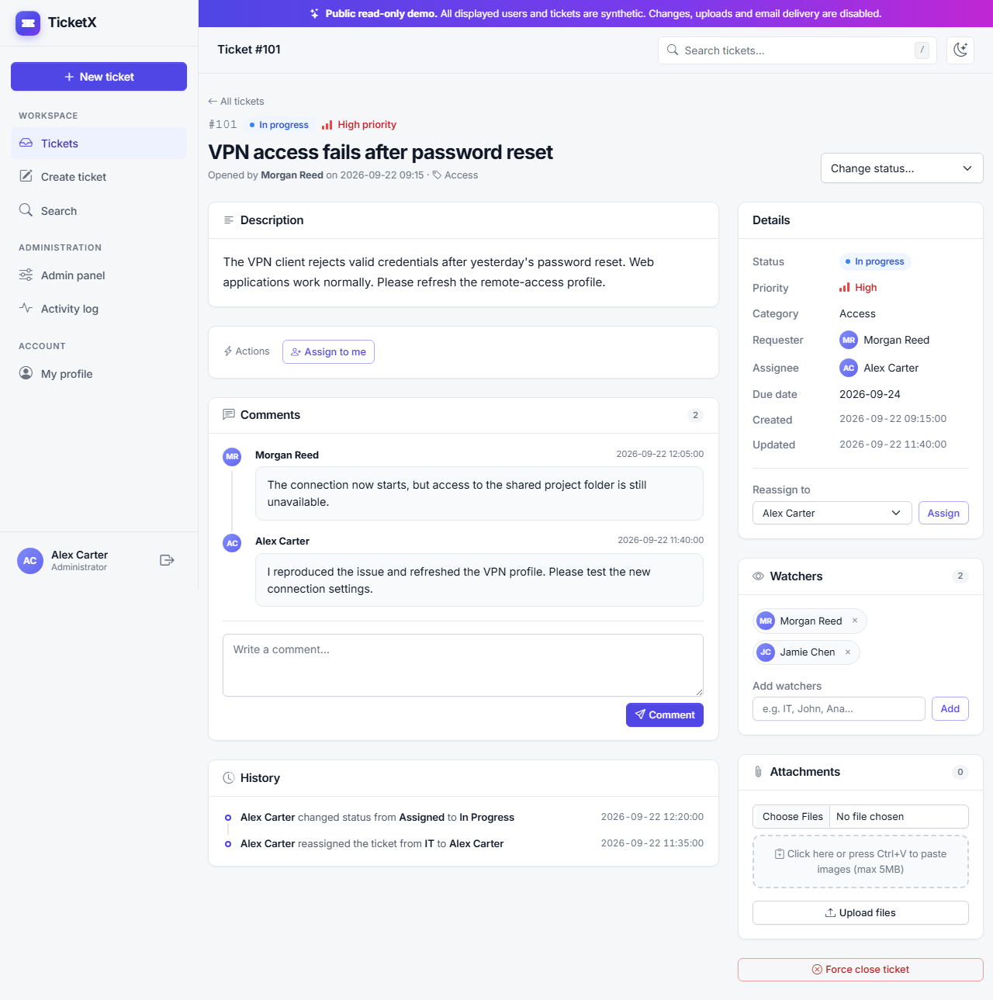
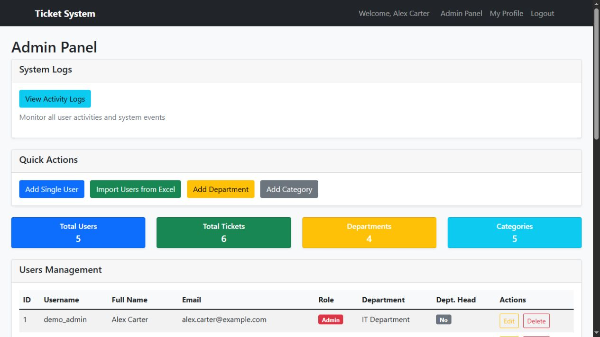

# TicketX

[](https://github.com/radojkovicm/TicketX/actions/workflows/ci.yml)

TicketX is a self-hosted helpdesk and ticketing application for internal IT and cross-department support. It provides role-based workflows, private tickets, comments, attachments, watchers, email notifications and an audit trail in a compact Flask + SQLite deployment.

## Screenshots

All screenshots below use synthetic demo users, tickets and `example.com` email addresses. No production or customer data is shown.

### Ticket dashboard



### Ticket workflow and collaboration



### Administration



## Features

- Ticket creation, assignment, priorities, due dates and status workflow
- Public and private tickets with server-side authorization checks
- Administrator, department-head and regular-user roles
- Comments, private attachment storage and protected downloads
- Watchers, mute controls and SMTP email notifications
- Reusable ticket templates, search and Excel user import
- Administrative user, department, category and activity-log views
- Automatic migration of legacy SHA-256 password hashes after a valid login
- CSRF protection, secure session cookies, security headers and login throttling

## Technology

- Python 3.11+
- Flask 3
- SQLite in WAL mode
- Jinja templates and Bootstrap 5
- OpenPyXL for `.xlsx` user imports

## Quick start

1. Clone the repository and enter it:

   ```powershell
   git clone https://github.com/radojkovicm/TicketX.git
   Set-Location TicketX
   ```

2. Create and activate a virtual environment:

   ```powershell
   py -3.11 -m venv .venv
   .\.venv\Scripts\Activate.ps1
   python -m pip install --upgrade pip
   python -m pip install -r requirements.txt
   ```

3. Create local configuration:

   ```powershell
   Copy-Item .env.example .env
   python -c "import secrets; print(secrets.token_hex(32))"
   ```

   Paste the generated value into `FLASK_SECRET_KEY` in `.env`. Set a strong, unique `INITIAL_ADMIN_PASSWORD` before the first start. Never commit `.env`.

4. Start TicketX:

   ```powershell
   python app.py
   ```

5. Open `http://localhost:5000`, sign in with the initial administrator credentials, change the password, and set `DISABLE_INITIAL_ADMIN_CREATION=true` in `.env`.

For Linux or macOS, activate the environment with `source .venv/bin/activate`; the remaining commands are the same.

## Configuration

| Variable | Purpose | Default |
| --- | --- | --- |
| `FLASK_SECRET_KEY` | Signs sessions and CSRF tokens; required | none |
| `DB_PATH` | SQLite database path | `database.db` |
| `UPLOAD_FOLDER` | Private attachment directory | `uploads` |
| `IS_HTTPS` | Enables secure cookies and HSTS | `false` |
| `APP_BASE_URL` | Base URL used in notification links | `http://localhost:5000` |
| `HOST` / `PORT` | Development server bind address and port | `127.0.0.1` / `5000` |
| `SESSION_TIMEOUT_SECONDS` | Inactivity timeout | `3600` |
| `TIMEZONE` | IANA timezone name | `Europe/Belgrade` |
| `ENABLE_ASYNC_EMAIL` | Sends notification email in background threads | `true` |
| `SMTP_*` | SMTP host, credentials, sender and TLS settings | see `.env.example` |
| `INITIAL_ADMIN_*` | One-time first administrator setup | none |
| `DISABLE_INITIAL_ADMIN_CREATION` | Disables bootstrap administrator creation | `false` |

The database, `.env`, logs and uploaded files are intentionally excluded from Git because they may contain credentials or personal data.

## Authorization model

- Administrators can view and manage all tickets.
- A private ticket is visible only to its creator, assignee, watchers and administrators.
- Public tickets are visible to authenticated users.
- Ticket management is limited to the creator, current assignee and administrators.
- Status transitions are enforced on the server; hiding a button in the UI is never treated as authorization.
- Attachment downloads repeat the ticket-access check and reject paths outside approved upload directories.

## Status workflow

```text
new / assigned -> in progress -> awaiting confirmation -> closed
                                               |             |
                                               +-- creator --+
closed -> in progress (reopen by creator, assignee or administrator)
```

Administrators may override the normal transition sequence when operationally necessary.

## Testing

Run the complete test suite:

```powershell
python -m unittest discover -s tests -v
```

The tests use temporary databases and upload directories. They do not read or modify your local `.env`, production database or real attachments. GitHub Actions runs the same suite on supported Python versions.

## Project structure

```text
TicketX/
├── app.py                     # Flask routes, workflow and authorization
├── auth.py                    # Authentication decorators and session timeout
├── database.py                # Schema, migrations, indexes and connections
├── models.py                  # User, ticket and category data access
├── notifications.py           # Notification recipient and message logic
├── mailer.py                  # SMTP delivery
├── security.py                # Password hashing and legacy migration
├── templates/                 # Jinja templates
├── static/                    # CSS and browser JavaScript
├── tests/                     # Automated security and workflow tests
├── deploy/iis/                # IIS configuration example
└── .github/workflows/         # Continuous integration
```

## Deployment

Do not expose Flask's built-in development server directly to the internet. Terminate HTTPS at IIS, nginx, Caddy or another trusted reverse proxy, set `IS_HTTPS=true`, and ensure only the application process can read `.env`, the SQLite database and `UPLOAD_FOLDER`.

### Read-only portfolio demo on Vercel

TicketX includes an optional disposable demo mode for public portfolio deployments. Normal local installations are unchanged because demo mode is disabled by default.

Set these environment variables in the Vercel project:

```text
DEMO_MODE=true
FLASK_SECRET_KEY=<a generated random value>
IS_HTTPS=true
```

When enabled, TicketX creates a synthetic SQLite database under Vercel's writable `/tmp` directory. The public account can browse the application, but state-changing requests, uploads and email delivery are disabled. No local database, `.env` file or uploaded attachment is included in the deployment.

For IIS, install `requirements-iis.txt`, copy `deploy/iis/web.config.example` to `web.config`, and replace every placeholder path. SQLite is suitable for a small single-server installation; a larger multi-instance deployment should move persistence and login throttling to shared services.

Back up the database and upload directory together. Restoring only one of them can leave attachment records without files or files without records.

## Security

Please do not publish vulnerability details in a public issue. Follow [SECURITY.md](SECURITY.md) to report a security problem privately.

## Contributing

See [CONTRIBUTING.md](CONTRIBUTING.md) for the development and pull-request workflow.
